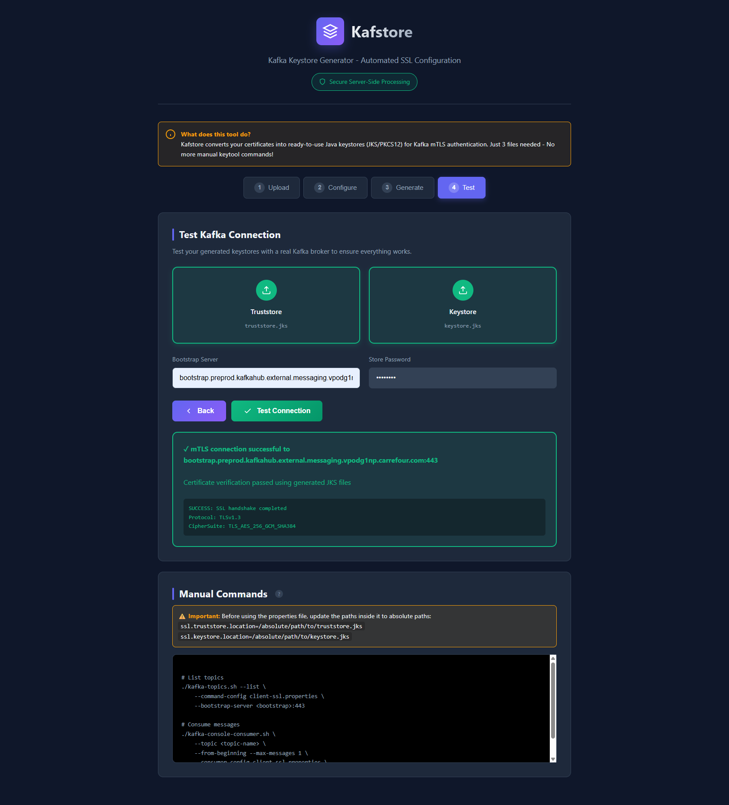
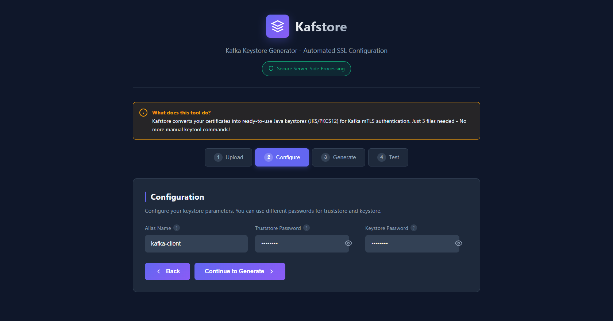
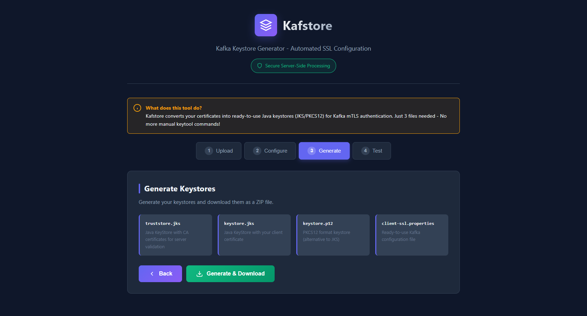

# Kafstore

**Kafka Keystore Generator - Automated SSL Configuration**

Transform your certificates into ready-to-use Kafka SSL keystores in seconds. Just 3 files needed - No more manual keytool commands!

[](https://opensource.org/licenses/MIT)
[](https://www.docker.com/)
[](https://www.python.org/downloads/)

## What is Kafstore?

Kafstore automates the tedious process of converting certificates into Java keystores (JKS/PKCS12) required for Kafka mTLS authentication. What used to take multiple manual commands now takes just a few clicks.




### Steps
1. Upload your **3 certificate files** (CA chain, bundle, key)
2. Configure alias and passwords (separate for truststore/keystore)
3. Click "Generate & Download"
4. Get your ready-to-use keystores in a ZIP file

## ✨ Features

- **📦 Simplified Upload**: Only 3 files needed (CA chain, bundle, key)
- **🔐 Separate Passwords**: Different passwords for truststore and keystore with visibility toggle
- **🤖 Automated Generation**: Creates JKS and PKCS12 keystores automatically
- **🔗 Complete CA Chain**: Properly handles multi-level certificate chains
- **✅ Built-in Testing**: Validates generated keystores with real Kafka brokers using Java
- **🎨 Modern UI**: Beautiful dark mode interface with tooltips and examples
- **🚀 Zero Manual Commands**: No need to remember complex keytool syntax
- **🔒 Secure Processing**: Server-side processing in isolated Docker containers
- **📁 No File Restrictions**: Upload files with or without extensions

## Quick Start

### Using Docker (Recommended)

```bash
# Clone the repository
git clone https://github.com/arabaaoui/kafstore.git
cd kafstore

# Build and run with Docker
docker build -t kafstore .
docker run -d -p 5000:5000 --name kafstore kafstore

# Access the application
open http://localhost:5000
```

### Using Docker Compose

```bash
# Start the application
docker-compose up -d

# View logs
docker-compose logs -f

# Stop the application
docker-compose down
```



### Manual Installation

**Prerequisites:**
- Python 3.11+
- Java JDK 17+ (for keytool)
- OpenSSL

**Steps:**

```bash
# Install dependencies
pip install -r requirements.txt

# Run the application
python app.py

# Access at http://localhost:5000
```

## 📖 Usage Guide



### Step 1: Upload Certificates

You need only **3 files** from your certificate authority:
- **CA Chain**: Complete certificate authority chain for truststore
- **Bundle**: Your client certificate + intermediate CAs for keystore
- **Private Key**: Your private key for keystore

**Note:** File extensions don't matter - Kafstore accepts files without extensions!

### Step 2: Configure

- **Alias**: A friendly name for your certificate (e.g., "kafka-prod-client")
- **Truststore Password**: Password for protecting `truststore.jks` (default: changeit)
- **Keystore Password**: Password for protecting `keystore.jks` and `keystore.p12` (default: changeit)

**New!** You can now use different passwords for truststore and keystore, with password visibility toggles.

### Step 3: Generate

Click "Generate Keystores" to create:
- `truststore.jks` - Contains CA certificates for server validation
- `keystore.jks` - Contains your client certificate (JKS format)
- `keystore.p12` - Contains your client certificate (PKCS12 format)
- `client-ssl.properties` - Ready-to-use Kafka configuration

### Step 4: Test (Optional)

Use the built-in tester to validate your keystores:
- Performs actual mTLS handshake with your Kafka broker
- Verifies certificate chain is complete
- Shows connection details on success

### Step 5: Download & Use

Download the ZIP file containing all generated files and use them with your Kafka clients:

```properties
# Example Kafka client configuration
security.protocol=SSL
ssl.truststore.location=/path/to/truststore.jks
ssl.truststore.password=your-truststore-password
ssl.keystore.location=/path/to/keystore.jks
ssl.keystore.password=your-keystore-password
ssl.key.password=your-keystore-password
```

**⚠️ Important:** Remember to update the absolute paths in the properties file before using it!

## Architecture

```
┌─────────────────┐
│  Web Interface  │ (Flask + Modern UI)
└────────┬────────┘
         │
    ┌────▼─────┐
    │  Flask   │ (Python Backend)
    │  API     │
    └────┬─────┘
         │
    ┌────▼──────────────┐
    │  Certificate      │
    │  Processing       │
    │  ├─ keytool       │ (Java)
    │  ├─ openssl       │
    │  └─ cryptography  │ (Python)
    └───────────────────┘
```

## API Endpoints

### POST /api/analyze
Analyzes uploaded certificates and returns metadata.

**Request:**
- `cert`: Certificate file (multipart/form-data)

**Response:**
```json
{
  "success": true,
  "certificates": [
    {
      "subject": "CN=example.com",
      "issuer": "CN=CA",
      "not_before": "2024-01-01T00:00:00",
      "not_after": "2025-01-01T00:00:00"
    }
  ]
}
```

### POST /api/generate
Generates keystores from uploaded certificates.

**Request:**
- `ca_chain`: CA chain file (multipart/form-data)
- `bundle`: Certificate bundle file (multipart/form-data)
- `key`: Private key file (multipart/form-data)
- `alias`: Keystore alias (form field)
- `truststore_password`: Truststore password (form field, default: "changeit")
- `keystore_password`: Keystore password (form field, default: "changeit")

**Response:**
- ZIP file containing generated keystores and configuration

### POST /api/test-kafka
Tests Kafka connection with generated keystores.

**Request:**
- `ca_chain`: CA chain file (multipart/form-data)
- `bundle`: Certificate bundle file (multipart/form-data)
- `key`: Private key file (multipart/form-data)
- `alias`: Keystore alias (form field)
- `bootstrap`: Kafka bootstrap server (form field)
- `truststore_password`: Truststore password (form field)
- `keystore_password`: Keystore password (form field)

**Response:**
```json
{
  "success": true,
  "message": "mTLS connection successful",
  "details": "Certificate verification passed",
  "ssl_info": "Protocol: TLSv1.3, CipherSuite: TLS_AES_256_GCM_SHA384"
}
```

## Troubleshooting

### "trustAnchors parameter must be non-empty"
**Cause:** CA chain file is missing or incomplete.
**Solution:** Ensure your CA chain file contains all intermediate and root certificates.

### "SSL connection failed"
**Cause:** Incorrect certificates or network issue.
**Solution:**
- Verify your certificate files are for the correct Kafka environment
- Check that the bootstrap server address is correct
- Ensure your network can reach the Kafka broker

### "Failed to compile SSL test"
**Cause:** Java not installed or not in PATH.
**Solution:** Install Java JDK 17+ and ensure `javac` is available.

## Development

### Project Structure
```
kafstore/
├── app.py                 # Flask application
├── templates/
│   └── index.html        # Web interface
├── Dockerfile            # Container definition
├── requirements.txt      # Python dependencies
├── docs/
│   └── screenshots/      # Interface screenshots
└── README.md            # This file
```

### Running Tests

```bash
# Test certificate generation
curl -X POST http://localhost:5000/api/analyze \
  -F "cert=@path/to/certificate"

# Test with sample files
docker exec -it kafstore python -c "import app; print('OK')"
```

### Building for Production

```bash
# Build optimized image
docker build -t kafstore:latest .

# Run with production settings
docker run -d \
  -p 5000:5000 \
  --name kafstore \
  --restart unless-stopped \
  kafstore:latest
```

## Security Considerations

- All certificate processing happens in isolated containers
- Temporary files are automatically cleaned up after processing
- Keystores are never stored on the server
- Passwords are not logged or persisted
- Use HTTPS in production to protect uploaded certificates

## Contributing

1. Fork the repository
2. Create a feature branch (`git checkout -b feature/amazing-feature`)
3. Commit your changes (`git commit -m 'Add amazing feature'`)
4. Push to the branch (`git push origin feature/amazing-feature`)
5. Open a Pull Request

## License

MIT License

Copyright (c) 2025 Kafstore Contributors

Permission is hereby granted, free of charge, to any person obtaining a copy
of this software and associated documentation files (the "Software"), to deal
in the Software without restriction, including without limitation the rights
to use, copy, modify, merge, publish, distribute, sublicense, and/or sell
copies of the Software, and to permit persons to whom the Software is
furnished to do so, subject to the following conditions:

The above copyright notice and this permission notice shall be included in all
copies or substantial portions of the Software.

THE SOFTWARE IS PROVIDED "AS IS", WITHOUT WARRANTY OF ANY KIND, EXPRESS OR
IMPLIED, INCLUDING BUT NOT LIMITED TO THE WARRANTIES OF MERCHANTABILITY,
FITNESS FOR A PARTICULAR PURPOSE AND NONINFRINGEMENT. IN NO EVENT SHALL THE
AUTHORS OR COPYRIGHT HOLDERS BE LIABLE FOR ANY CLAIM, DAMAGES OR OTHER
LIABILITY, WHETHER IN AN ACTION OF CONTRACT, TORT OR OTHERWISE, ARISING FROM,
OUT OF OR IN CONNECTION WITH THE SOFTWARE OR THE USE OR OTHER DEALINGS IN THE
SOFTWARE.

## Support

For questions or issues:
- Create an issue in the [GitHub repository](https://github.com/arabaaoui/kafstore/issues)
- Check the troubleshooting section above
- Review the [documentation](https://github.com/arabaaoui/kafstore)

## Changelog

### v2.0.0 (2025-11-21)
- **Breaking:** Simplified upload to only 3 files (removed redundant cert file)
- Added separate password support for truststore and keystore
- Added password visibility toggles
- Removed bootstrap field from configuration (only needed for testing)
- Renamed from "Kafka SSL Wizard" to "Kafstore"
- Converted to open source (MIT License)
- Updated documentation with screenshots

### v1.0.0 (2025-11-21)
- Initial release
- Automated JKS/PKCS12 generation
- Built-in connection testing
- Modern web interface with tooltips
- Docker support
